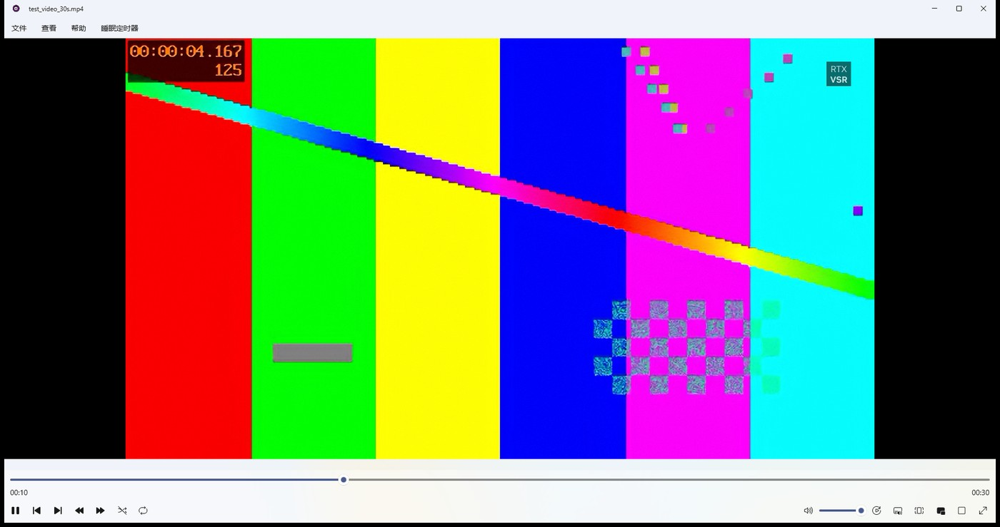
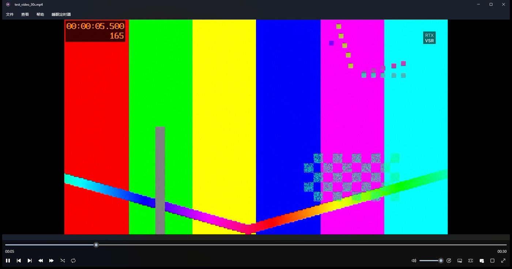
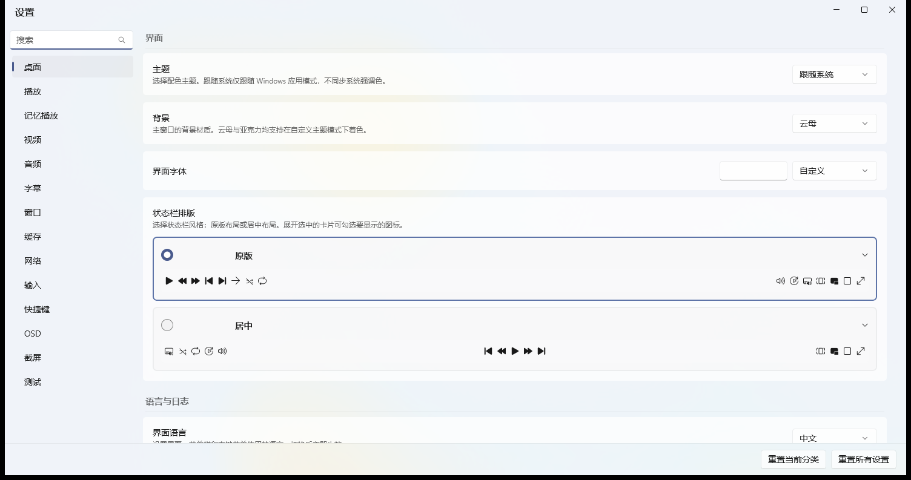
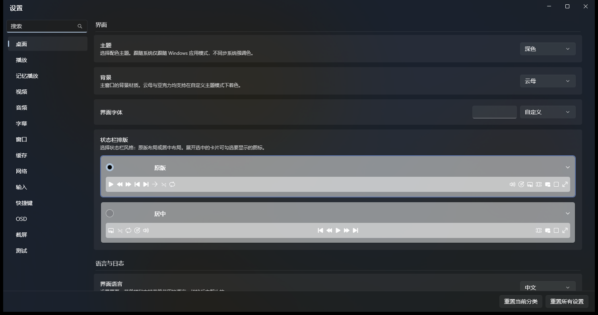
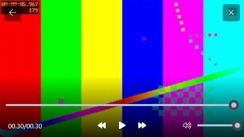
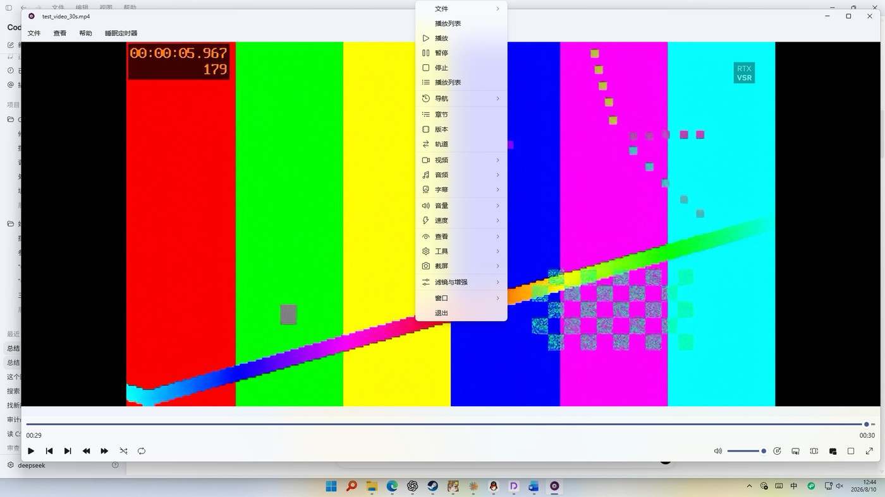

# mpv-winui-player

[](LICENSE.txt)
[]()
[](https://github.com/saillill/mpv-winui-player/releases)

[简体中文](README_zh-CN.md)

> A WinUI 3 media player powered by libmpv, with a curated config layer based on
> mpv-lazy. It focuses on correct HDR/WCG output in embedded composition mode,
> a PotPlayer-style settings window with ~184 live-applied options, 8-language
> localization, and a polished picture-in-picture window.

## Screenshots

| Light | Dark |
|---|---|
|  |  |
|  |  |





## Highlights

- **Engine**: libmpv embedded through the `mpv_winrt` C++/WinRT component,
  rendered with `vo=gpu-next` + `d3d11-output-mode=composition` — no window
  border flicker, native WinUI overlay, hardware decoding (d3d11va).
- **HDR / WCG**: the app reads `DisplayInformation` and writes
  `user-data/mpvw/color-kind` (`SDR` / `WCG` / `HDR`) plus the refresh rate to
  mpv; `profiles.conf` switches output parameters automatically. This fixes
  the washed-out HDR that upstream had in composition mode.
- **Settings**: a PotPlayer-style two-pane window (left categories, right
  option cards) with ~184 options. Every option applies to mpv immediately,
  conflicts are greyed out, ineffective options show yellow notes, list options
  show localized presets (never raw mpv keys), and paths get a folder picker
  plus an "open in Explorer" button.
- **Localization**: 8 languages (en-US, zh-CN, ja-JP, ko-KR, de-DE, fr-FR,
  es-ES, ru-RU) covering the app UI, the menu bar, and the 153-item mpv
  right-click menu (translated through `user-data/mpvw/language`).
- **Picture-in-picture**: a dedicated borderless always-on-top window with DWM
  rounded corners, native edge resize (OS size cursors + border drag via the
  kept `WS_THICKFRAME`), drag-anywhere moving, and the fullscreen compact
  control bar (time, transport, volume, progress). The official
  `CompactOverlayPresenter` was prototyped but rejected: it draws a system
  title bar that swallows the overlay buttons and blocks drag-anywhere moving
  (see [WindowsAppSDK#1593](https://github.com/microsoft/WindowsAppSDK/issues/1593)).
  `AppWindowTitleBar.SetDragRectangles` was also prototyped as the official
  drag-move replacement, but the OS ignores drag regions on a fully frameless
  window. Drag-anywhere tracks the cursor with `GetCursorPos` and moves with
  the official `AppWindow.Move`; the earlier WM_NCLBUTTONDOWN/HTCAPTION modal
  loop made the window stick to the cursor after release. Resize is native:
  `OverlappedPresenter.IsResizable=true` plus `WS_THICKFRAME` kept in
  `MakeFrameless`, so the OS handles edge hit-testing, size cursors and the
  border drag; the swap chain follows via `AppWindow.Changed` with the 300ms
  debounced size re-assert.
- **Video preview**: thumbfast renders thumbnails through a bundled standalone
  `mpv.exe`; the app draws them as a rounded WinUI card above the progress bar.
- **Mouse input**: wheel over the video controls volume/seek and the mouse
  buttons follow `input.conf` (left = play/pause, double-click = fullscreen,
  X1/X2 = playlist prev/next), matching the documented mpv-lazy bindings.

## What's new vs. upstream

Upstream app: [ikas-mc/mpv-winui-player](https://github.com/ikas-mc/mpv-winui-player)

| Area | Upstream | This project |
|---|---|---|
| HDR/WCG output | SDR-only workaround; HDR washed out in composition mode | Auto `mpvw-sdr/wcg/hdr` profiles; WCG → bt.2020 (invalid `display-p3` fixed); HDR → `target-trc=pq` + `target-prim=bt.2020` + `target-peak=1000`; `target-colorspace-hint=yes` while RTX HDR is active |
| Localization | English-only hardcoded strings | `AppLang` + JSON, 8 languages, immediate switch |
| Player settings | Minimal | ~184 categorized options, live-applied + applied at startup |
| MediaInfo | Not bundled | Official MediaInfo CLI v26.05 (BSD-2-Clause) bundled |
| CLI / protocol | Broken in unpackaged mode | Command line and `mpv-winui://` activation fixed and verified |
| Logging | mpv verbose by default | Off by default (`log-file` commented, `hdr_auto` `log=no`) |
| Config layer | Not shipped | `mpv-winui-lazy/` (mpv-lazy based): HDR/WCG profiles, RTX HDR/VSR scripts, clean key bindings, MediaInfo config |
| Build & release | Manual | `build.ps1` / `package.ps1`; GitHub Actions produces unpackaged + Release zip without a signing certificate |

## Quick start

1. Download `mpv-winui-win-x64-Release.zip` from the
   [Releases page](https://github.com/saillill/mpv-winui-player/releases).
2. Extract it anywhere (Windows 10/11 x64).
3. Deploy the config layer once:

   ```powershell
   powershell -File mpv-winui-lazy\deploy-config.ps1
   ```

4. Run `mpv-winui.exe`. Open files from the menu, drag & drop, the command
   line, or the URL protocol:

   ```powershell
   mpv-winui.exe "D:\Videos\movie.mkv"
   mpv-winui://?file=D%3A%5CVideos%5Cmovie.mkv
   ```

## Configuration

### HDR / WCG auto profiles (`mpv-winui-lazy/profiles.conf`)

```ini
[mpvw-sdr]
profile-cond=p["user-data/mpvw/color-kind"] == "SDR"
profile-restore=copy
d3d11-output-csp=srgb
d3d11-output-format=rgb10_a2

[mpvw-wcg]
profile-cond=p["user-data/mpvw/color-kind"] == "WCG"
profile-restore=copy
d3d11-output-csp=bt.2020

[mpvw-hdr]
profile-cond=p["user-data/mpvw/color-kind"] == "HDR"
profile-restore=copy
d3d11-output-csp=pq
target-trc=pq
target-prim=bt.2020
target-peak=1000
```

Notes: `d3d11-output-csp=display-p3` is not a valid value; HDR needs all three
`target-*` options or the swap chain is PQ while the render pipeline stays SDR
and the driver never switches to HDR.

### RTX Video HDR / NVIDIA VSR

- `script-opts/hdr_auto.conf`: `log=no` by default; `mode=auto|on|off`.
- `script-opts/mpvw_hdr_override.conf`: `mode=` empty = follow the app;
  `HDR` / `SDR` force an override.
- `script-opts/vsr_auto.conf` and `script-opts/seek_hold.conf`: automatic
  NVIDIA VSR and seek-hold behavior.

### Key bindings (`mpv-winui-lazy/input.conf`)

Mouse wheel over the video: volume (up/down) and seek (left/right) · left click:
play/pause · double-click: fullscreen · X1/X2: playlist prev/next · `` ` ``:
console · F6/F7: playlist/track info · TAB: stats · Alt+i: MediaInfo ·
Ctrl+1..0: color adjust · w/W: panscan · `[ ] { }`: speed.

### Localization / MediaInfo / logs

- Language: Settings page, or edit `Languages\<lang>.json` (keys are `AppLang`
  property names). Right-click menus use the same language via
  `user-data/mpvw/language`; all 8 languages are covered in `dyn_menu.lua` /
  `dynamic_menu.lua`.
- MediaInfo: `script-opts/stats_mediainfo.conf` → `mediainfo_path=~~/MediaInfo.exe`.
- Troubleshooting: uncomment `log-file` in `mpv.conf` and set
  `msg-level=all=v`; set `log=yes` in `hdr_auto.conf`.

### Settings window

Categories: Desktop (interface / background / fonts / control-bar layout /
language & logging / file associations), Playback, Resume, Video, Audio,
Subtitles, Window, Cache, Network, Input, Shortcuts, OSD, Screenshot, Test.
Everything applies live; "Reset current category" and "Reset all settings" are
at the bottom. The left search box supports pinyin (Chinese), romaji
(Japanese) and romanized Korean matching.

## Build & release

| Requirement | Notes |
|---|---|
| Windows 10/11 x64 | target platform |
| [.NET 10 SDK](https://dotnet.microsoft.com/) | builds the C# WinUI 3 app |
| Visual Studio Build Tools (C++ workload) | builds `mpv_winrt` (`VCTargetsPath` is a VS component) |
| Windows App SDK 2.3.x | restored via NuGet |
| `mpv-2.dll` | downloaded from [ikas-mc/mpv-windows-builder](https://github.com/ikas-mc/mpv-windows-builder) into `mpv-winui\libs\` |

```powershell
.\build.ps1 -Configuration Release -Platform x64
.\package.ps1 -Configuration Release -Platform x64   # -> dist\mpv-winui-win-x64-Release.zip
```

CI (`.github/workflows/build.yml`, manual `workflow_dispatch`) builds the same
way; without certificate secrets it skips MSIX and uploads the unpackaged
output plus the Release zip.

## Upstream references & library usage

### Project sources

| Project | Used for |
|---|---|
| [ikas-mc/mpv-winui-player](https://github.com/ikas-mc/mpv-winui-player) | Upstream app baseline (WinUI shell + `mpv_winrt` component) |
| [hooke007/mpv_PlayKit](https://github.com/hooke007/mpv_PlayKit) (mpv-lazy) | Config layer baseline: `mpv.conf`, `profiles.conf`, `input.conf`, scripts, shaders |
| [mpv-player/mpv](https://github.com/mpv-player/mpv) | Core playback engine (libmpv + bundled CLI for thumbfast) |
| [haasn/libplacebo](https://github.com/haasn/libplacebo) | Rendering inside mpv's `gpu-next` VO |
| [ikas-mc/mpv-windows-builder](https://github.com/ikas-mc/mpv-windows-builder) | Windows `mpv-2.dll` builds |
| [shinchiro/mpv-winbuild-cmake](https://github.com/shinchiro/mpv-winbuild-cmake) | Standalone `mpv.exe` bundled for thumbfast |
| [tsl0922/mpv-menu-plugin](https://github.com/tsl0922/mpv-menu-plugin) | `dyn_menu.lua` / `dialog.lua` (mpv right-click menu data) |
| [po5/thumbfast](https://github.com/po5/thumbfast) | Thumbnail preview engine |
| [CogentRedTester/mpv-coverart](https://github.com/CogentRedTester/mpv-coverart) | Cover art loading |
| [natural-harmonia-gropius/recent-menu](https://github.com/natural-harmonia-gropius/recent-menu) | Recent files menu |
| [vc-01/metadata-osd](https://github.com/vc-01/metadata-osd) | Metadata OSD |
| [MediaArea/MediaInfo](https://mediaarea.net/en/MediaInfo) | MediaInfo CLI (tool menu) |
| [apades/dmMiniPlayer](https://github.com/apades/dmMiniPlayer) | PiP UX reference (documentPictureInPicture) |

### Runtime libraries used by the app

| Library | License | Purpose |
|---|---|---|
| Windows App SDK / WinUI 3 | MIT | UI framework |
| CsWinRT / CsWin32 | MIT | C#/WinRT interop and Win32 P/Invoke generation |
| NLog | BSD-3 | Logging |
| .NET | MIT | Managed runtime |
| libmpv / libplacebo | LGPL-2.1+ | Playback and rendering |
| MediaInfo CLI | BSD-2-Clause | File metadata |
| Source Han Sans / LXGW WenKai Mono Lite | SIL OFL-1.1 | Bundled fonts (optional) |
| Shaders (Anime4K, FSRCNNX, nnedi3, NVIDIA, etc.) | See file headers / THIRD_PARTY_NOTICES | Optional upscaling/enhancement |
| VapourSynth templates (`vs/*.vpy`) | mpv-lazy maintained | Optional VapourSynth workflows |

## License compliance

- App code: **LGPL-2.1** ([LICENSE.txt](LICENSE.txt), same as upstream).
- Config layer project-written parts: **LGPL-2.1-or-later**; third-party
  components keep their own licenses.
- `dyn_menu.lua` and `dialog.lua` are **GPL-2.0-only** source scripts; they are
  distributed as source with provenance (the previously bundled `menu.dll`
  GPL binary was removed — the shipped mpv uses its native `menu-data` path).
- The bundled `mpv.exe` is **GPL-2.0+** (a separate program used by thumbfast);
  source is available from the upstream repositories.
- The config layer is derived from mpv-lazy; its `LICENSE.MD` treats files it
  does not list as UNLICENSED, so provenance is preserved for copied files.
- Full component list and license texts:
  [mpv-winui-lazy/THIRD_PARTY_NOTICES.md](mpv-winui-lazy/THIRD_PARTY_NOTICES.md),
  [fonts/OFL-1.1.txt](mpv-winui-lazy/fonts/OFL-1.1.txt),
  [licenses/MediaInfo-BSD-2-Clause.txt](mpv-winui-lazy/licenses/MediaInfo-BSD-2-Clause.txt).

## Known limitations

- The display monitor name field in `display-info.log` can be empty on some
  multi-monitor setups (the HDR kind and refresh rate are still tracked).
- `keep-open=always` pauses at the end of a file by design; loop-playlist then
  advances when playback resumes.
- Unpackaged mode requires `deploy-config.ps1` once so the config layer lands in
  `%LOCALAPPDATA%\mpv-winui\mpv`.
